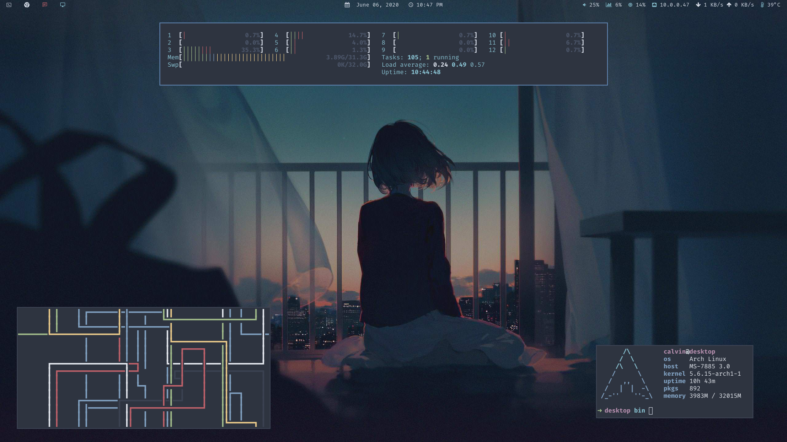

# dotfiles

My dotfiles for a nord desktop theme

## Wallpaper

- https://i.imgur.com/CpfD8yB.jpg (Current)
- https://unsplash.com/photos/vpHCfunwDrQ
- https://unsplash.com/photos/n3i9j5qPiE4

## Demos

Find the scripts for the demos in the `scripts` folder. Note that these were made for fun, and I do not use any of them on my setup.

- `blur.mp4`: Blur the background when a window is in focus, using bspc subscribe, feh, and imagemagick.
- `changetheme.mp4`: A script to change the desktop theme. Can be used in combination with sxhkd.
- `chwp.mp4`: Different wallpaper for each desktop/workspace.
